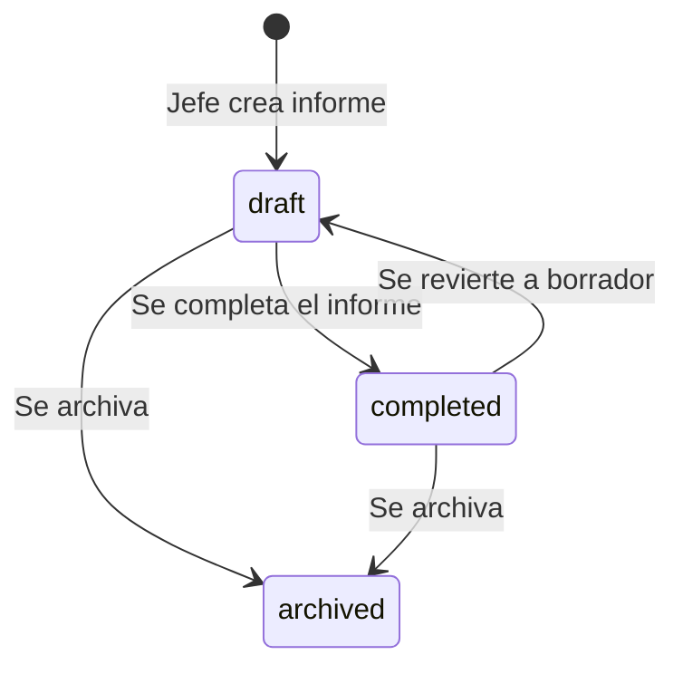

# Diagrama Relacional — Backend Strapi (desplegado)

Diagrama generado a partir de la estructura real de `backend-strapi/src/api/` (Strapi 5.49).

## Modelo Entidad-Relación

```mermaid
erDiagram
    FORM_TYPE ||--o{ FORM_TEMPLATE_VERSION : "tiene"
    FORM_TYPE ||--o{ FORMAT_MANAGER : "instancia"
    FORM_TEMPLATE_VERSION ||--o{ FORMAT_MANAGER : "versiona"
    FORM_TEMPLATE_VERSION }o--o{ FORM_SECTION : "contiene"
    FORM_SECTION }o--o{ FORM_FIELD : "tiene"
    FORM_SECTION ||--o{ SECTION_VALUE : "referencia"
    FORM_FIELD ||--o{ FIELD_VALUE : "define"
    FORMAT_MANAGER ||--o{ TEACHER_ENTRY : "agrupa"
    FORMAT_MANAGER ||--o{ SECTION_VALUE : "contiene"
    TEACHER_ENTRY ||--o{ FIELD_VALUE : "evalua"
    USER ||--o{ FORMAT_MANAGER : "crea"

    FORM_TYPE {
        int id PK
        uid uid "auto"
        string label_type
        string type
        string description
    }

    FORM_TEMPLATE_VERSION {
        int id PK
        uid uid "auto"
        string label_template_version
        string template_version
        boolean active
    }

    FORM_SECTION {
        int id PK
        uid uid "auto"
        string label_form_section
        string form_section
        int order
        enum section_type "header_table | description_text | free_text | parameter_table | teacher_observation | signature"
    }

    FORM_FIELD {
        int id PK
        uid uid "auto"
        string label_form_field
        int order
        enum field_type "select | rating | textarea | text"
        json options
        boolean required
        string group
        enum render_as "grid_cell | observation_block"
    }

    FORMAT_MANAGER {
        int id PK
        uid uid "auto"
        string area
        string career
        enum status_form "draft | completed | archived"
        date report_date
        int user_id "nullable"
        datetime createdAt
        datetime updatedAt
    }

    TEACHER_ENTRY {
        int id PK
        uid uid "auto"
        string teacher_name
        string subject
        string group
        string cycle
        string project
        string code
    }

    FIELD_VALUE {
        int id PK
        uid uid "auto"
        text value
    }

    SECTION_VALUE {
        int id PK
        uid uid "auto"
        text value
        datetime createdAt
        datetime updatedAt
    }

    USER {
        int id PK
        string username
        string email
        string password
        string area "nullable"
        enum role_type "admin | jefe_area" "nullable"
        boolean confirmed
        boolean blocked
        role role FK
        format_managers relation FK "oneToMany"
    }
```

## Resumen de Relaciones

| # | Origen | Tipo | Destino | Cardinalidad |
|---|--------|------|---------|-------------|
| 1 | `form-type` | `oneToMany` (mappedBy: `form_type`) | `form-template-version` | 1 → N |
| 2 | `form-type` | `oneToMany` (mappedBy: `form_type`) | `format-manager` | 1 → N |
| 3 | `form-template-version` | `manyToOne` (inversedBy: `form_template_versions`) | `form-type` | N → 1 |
| 4 | `form-template-version` | `oneToMany` (mappedBy: `form_template_version`) | `format-manager` | 1 → N |
| 5 | `form-template-version` | `manyToMany` (mappedBy: `form_template_versions`) | `form-section` | N ↔ N |
| 6 | `format-manager` | `manyToOne` (inversedBy: `format_managers`) | `user` (plugin) | N → 1 |
| 7 | `form-section` | `manyToMany` (inversedBy: `form_sections`) | `form-template-version` | N ↔ N |
| 8 | `form-section` | `manyToMany` (mappedBy: `form_sections`) | `form-field` | N ↔ N |
| 9 | `form-section` | `oneToMany` (mappedBy: `form_section`) | `section-value` | 1 → N |
| 10 | `form-field` | `manyToMany` (inversedBy: `form_fields`) | `form-section` | N ↔ N |
| 11 | `form-field` | `oneToMany` (mappedBy: `form_field`) | `field-value` | 1 → N |
| 12 | `format-manager` | `manyToOne` (inversedBy: `format_managers`) | `form-type` | N → 1 |
| 13 | `format-manager` | `manyToOne` (inversedBy: `format_managers`) | `form-template-version` | N → 1 |
| 14 | `format-manager` | `oneToMany` (mappedBy: `format_manager`) | `teacher-entry` | 1 → N |
| 15 | `format-manager` | `oneToMany` (mappedBy: `format_manager`) | `section-value` | 1 → N |
| 16 | `teacher-entry` | `manyToOne` (inversedBy: `teacher_entries`) | `format-manager` | N → 1 |
| 17 | `teacher-entry` | `oneToMany` (mappedBy: `teacher_entry`) | `field-value` | 1 → N |
| 18 | `field-value` | `manyToOne` (inversedBy: `field_values`) | `form-field` | N → 1 |
| 19 | `field-value` | `manyToOne` (inversedBy: `field_values`) | `teacher-entry` | N → 1 |
| 20 | `section-value` | `manyToOne` (inversedBy: `section_values`) | `form-section` | N → 1 |
| 21 | `section-value` | `manyToOne` (inversedBy: `section_values`) | `format-manager` | N → 1 |
| 22 | `user` (plugin) | `oneToMany` (mappedBy: `user`) | `format-manager` | 1 → N |

## Relaciones Clave

```
FORM_TYPE (1) ──< FORM_TEMPLATE_VERSION (N)
    Cada tipo de formulario puede tener múltiples versiones (v2025, v2026...)

FORM_TYPE (1) ──< FORMAT_MANAGER (N)
    Cada informe apunta al tipo de formulario que lo originó

FORM_TEMPLATE_VERSION (N) >── M:N ──> (N) FORM_SECTION
    Una versión incluye N secciones; una sección está en N versiones (Strapi maneja la tabla pivote internamente)

FORM_SECTION (N) >── M:N ──> (N) FORM_FIELD
    Una sección contiene N campos; un campo pertenece a N secciones (Strapi maneja la tabla pivote internamente)

FORMAT_MANAGER (N) ──> USER (1)
    Cada informe pertenece a un Jefe de Área (usuario creador)

USER (1) ──< FORMAT_MANAGER (N)
    Un usuario puede crear múltiples informes

FORM_TEMPLATE_VERSION (1) ──< FORMAT_MANAGER (N)
    Un FORMAT_MANAGER (informe completado) apunta a la versión de plantilla que usó

FORMAT_MANAGER (1) ──< TEACHER_ENTRY (N)
    Filas de docente/asignatura/grupo dentro del informe

TEACHER_ENTRY (1) ──< FIELD_VALUE (N)
    Valores EAV por campo dinámico (ej. SB: Sílabo cargado → "Sí")

FORM_FIELD (1) ──< FIELD_VALUE (N)
    Un campo puede tener N valores (uno por docente)

FORMAT_MANAGER (1) ──< SECTION_VALUE (N)
    Textos libres por sección (Antecedentes, Objetivos, Análisis...)

FORM_SECTION (1) ──< SECTION_VALUE (N)
    Una sección tiene N valores (uno por informe que la contiene)
```

## Diferencias con el diseño previo (strapi-schemas v2)

| Aspecto | Diseño previo (DIAGRAM.md viejo) | Backend real desplegado |
|---------|----------------------------------|------------------------|
| Puentes N:N | `FORM_SECTION_VERSION` y `FORM_FIELD_SECTION` como content types explícitos | Strapi maneja M:N internamente (tablas pivote automáticas) |
| User → Format Manager | FK directa `user_id` en `FORMAT_MANAGER` | `format-manager.user` (relation manyToOne) + `user_id` (integer, redundante) + `user.format_managers` (inversa) |
| `status` en Format Manager | Enum `draft \| completed \| in_correction` | Enum `draft \| completed \| archived` + `draftAndPublish: true` |
| Correcciones en Field Value | `needs_correction` + `correction_comment` | No existen esos campos |
| User (extensión) | `nombre`, `apellido`, `role_label`, `area`, `carrera` | `area`, `role_type` (`admin`/`jefe_area`), `format_managers` |
| Nombres de campo en Form Type | `label_name`, `name`, `slug` (uid) | `label_type`, `type` (string) |
| Nombres de campo en Template | `version_label`, `name`, `is_active` | `label_template_version`, `template_version`, `active` |
| Nombres de campo en Section | `label_name`, `name` | `label_form_section`, `form_section` |
| Nombres de campo en Field | `label_name` | `label_form_field` |
| `FORMAT_MANAGER.jefe_area` | Existía | No existe |
| `FORMAT_MANAGER.period` | Existía | No existe |
| `FORMAT_MANAGER.form_type` | No existía (solo template → type) | FK directa a `form-type` |
| Format Manager → User | No existía | `format-manager.user` (manyToOne → user). Relación actual |
| User → Format Manager | No existía | `user.format_managers` (oneToMany → format-manager). Inversa de la anterior |
| Controller/Service custom | No aplica | Todos usan `createCoreController` / `createCoreService` — sin lógica custom |

## Ciclo de Vida de un FORMAT_MANAGER



> **Nota:** El estado `in_correction` no existe en el backend desplegado. El enum real es `draft | completed | archived`. `section-value` y `format-manager` tienen `draftAndPublish: true`, lo que añade los estados `published`/`draft` de Strapi además del campo `status_form`.

## Consultas Clave

### Obtener plantilla activa con secciones y campos
```
GET /api/form-template-versions
  ?filters[form_type][type][$eq]=informe-seguimiento
  &filters[active][$eq]=true
  &populate[form_sections][populate][form_fields]=*
```

### Listar informes (dashboard)
```
GET /api/format-managers
  &populate[form_template_version][populate][form_type]=true
  &populate[teacher_entries][fields][0]=id
  &populate[form_type]=true
  &populate[user]=true
  &sort=createdAt:desc
```

### Ver detalle de un informe
```
GET /api/format-managers/{documentId}
  &populate[form_template_version][populate][form_sections][populate][form_fields]=*
  &populate[teacher_entries][populate][field_values][populate][form_field]=true
  &populate[section_values][populate][form_section]=true
  &populate[form_type]=true
  &populate[user]=true
```

## Patrón EAV

El sistema usa **EAV (Entity-Attribute-Value)** para campos dinámicos. En lugar de columnas fijas en SQL:

```
Definición (FORM_FIELD):
  1. "SB: Sílabo cargado en AVAC"  → tipo select, grupo SB
  2. "VA: Asistencia y puntualidad" → tipo select, grupo VA

Entidad (TEACHER_ENTRY):
  Docente: "María López", Asignatura: "Programación"

Valores (FIELD_VALUE):
  form_field=1, teacher_entry=X → "Sí"
  form_field=2, teacher_entry=X → "No"
```

## Endpoints Strapi (content-type)

| Content Type | Endpoint | draftAndPublish | Notas |
|-------------|----------|:-|-------|
| `form-type` | `/api/form-types` | No | Seed: 4 tipos |
| `form-template-version` | `/api/form-template-versions` | No | Una activa por tipo |
| `form-section` | `/api/form-sections` | No | Reutilizable entre versiones |
| `form-field` | `/api/form-fields` | No | Reutilizable entre secciones |
| `format-manager` | `/api/format-managers` | **Sí** | Instancia de informe |
| `teacher-entry` | `/api/teacher-entries` | No | Docente evaluado |
| `field-value` | `/api/field-values` | No | Valor EAV |
| `section-value` | `/api/section-values` | **Sí** | Texto libre de sección |

> No existen content types `form-section-version` ni `form-field-section` en el backend desplegado. Las relaciones M:N las gestiona Strapi internamente.

## Notas de Arquitectura

- **8 content types personalizados** + extensión `users-permissions.user` (campos `area`, `format_managers`).
- **Sin código custom**: todos los controllers/services/routes usan fábricas core de Strapi.
- **Sin lifecycle hooks, middlewares, policies, ni bootstrap/register logic.**
- **CORS**: solo `http://localhost:3000`.
- **Base de datos**: SQLite (`.tmp/data.db`) en desarrollo; soporta MySQL/PostgreSQL.
- **Frontend**: Next.js 16 en `http://localhost:3000` consume estos endpoints vía `lib/api.ts`.
